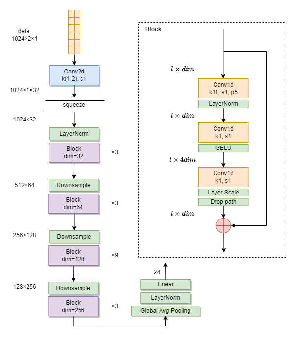

# Radio Signal Classification Based on Deep Learning
## 项目概述
本项目实现的是用卷积神经网络对无线电信号调制的识别，共24种调制格式。

网络结构参考了较新的（2022.1）ConvNeXt网络,论文地址：[https://arxiv.org/abs/2201.03545](https://arxiv.org/abs/2201.03545)

下面我画的网络框架图，方便读者理解：



## 数据集
数据集下载地址：http://opendata.deepsig.io/datasets/2018.01/2018.01.OSC.0001_1024x2M.h5.tar.gz

### 数据集说明
每个样本包含两路信号：I信号和Q信号，组成一个(1024, 2)的数据矩阵。数据集包含24种调制格式，
每种调制格式包含26种信噪比，每种信噪比下有4096个样本，总计4096×24×26=2,555,904个样本。

数据集是一个HDF5文件，内部结构类似文件夹。第一层包含3个datasets，其key值为：”X“, "Y", "Z"

”X“：数据集文件，大小为2555904×1024×2，2555904条1024*2的IQ信号

”Y“：调制格式文件，存储的是”X“下每个样本对应的调制格式，大小为2555904×24，存储的是0和1，1的位置（在行向量）对应调制格式标签。
相当于以one-hot的格式表示的调制格式，方便送入网络，当然也可以自行转换为0-23的数字。

”Z“：信噪比文件，大小为2555904×1，存储的是`[-20, -18, -16, -14, -12, -10, -8, -6, -4, -2, 0, 2, 4, 6, 8, 10, 12, 14, 16, 18, 20, 22, 24, 26, 28, 30]`这些数字,
对应的是“X"数据集相应位置的信噪比。
## 文件说明

|      文件       |        说明        |
|:-------------:|:----------------:|
|    models     |       模型文件       |
|  my_dataset   |      自定义数据集      |
|     utils     |    自定义的一些函数工具    |
|     train     |       训练文件       |
| class_indices |   数字和调制格式的键值对    |
|    picture    |    README用到的图    |
|     runs      | tensorboard可视化文件 |
|    weights    |      训练的权重       |

## 快捷运行
我的环境：
- miniconda3
- PyTorch 1.11 GPU(CPU也行)
- PyCharm(IDE)
- python3.9

执行以下命令：
```commandline
python train.py --data-path ./data/2018/GOLD_XYZ_OSC.hdf5
```
注意：修改自己文件路径，必须是绝对路径，因为h5py.File()读取文件时不支持相对路径


